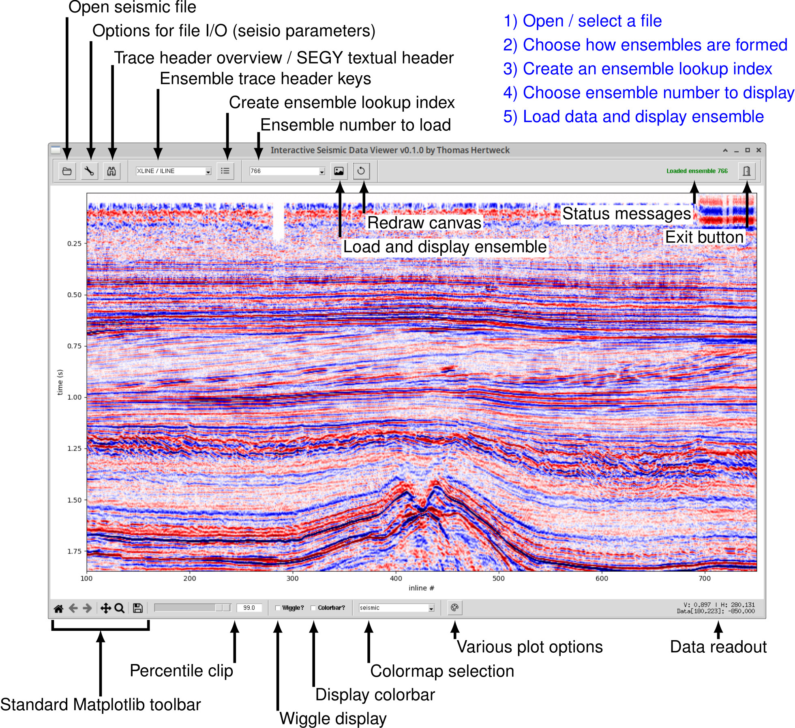

# seisiview

Interactive seismic data visualization.

## Description

The **seisiview** package provides an interactive GUI for seismic data visualization, including velocity models. It can load 2D or 3D SEG-Y or SU data and present slices of data in an interactive way. 

## Key features

* Pure Python code based on tkinter, i.e., minimal external dependencies.
* Uses the **seisio** module for I/O of data.
* GUI allows users to interactively change clips, axis labels, axis ticks, colormaps, and many more parameters. 

## Getting Started

### Dependencies

Required: matplotlib, numpy, seisio, tktooltip, ttkbootstrap, ttkbootstrap-icons, ttkbootstrap-icons-bs

The **seisio** packages requires: numba, numpy, pandas, tabulate

### Installation

*Install from PyPI:*

```
$> pip install seisiview
```

*Install directly from gitlab:*

```
$> pip install git+https://gitlab.kit.edu/thomas.hertweck/seisiview.git
```

*Editable install from source:*

This version is intended for experts who would like to test the latest version or make modifications. Normal users should prefer to install a stable version.

```
$> git clone https://gitlab.kit.edu/thomas.hertweck/seisiview.git
```

Once you acquired the source, you can install an editable version of seisiview with:

```
$> cd seisiview
$> pip install -e .
```

An alternative location of the source is https://github.com/ThomasHertweck/seisiview.

## Overview

<p align="center">



</p>


## Testing

The current version of the **seisiview** package has primarily been tested on Linux and Windows using Python 3.14.

## Main author

Dr. Thomas Hertweck, geophysics@email.de

## Citation

If you use the **seisiview** package and you find it useful, getting some feedback would be very much appreciated. If you would like to cite this package, please use, for instance:
```
Hertweck, T. (2026). seisiview: A Python GUI for interactive visualization of seismic data. Version 0.1. url: https://gitlab.kit.edu/thomas.hertweck/seisiview/ (visited on 07/01/2026).
```
Adjust year, version and last visited date as required. Here's a BibTeX entry:
```
@software{seisio,
  author  = {Hertweck, Thomas},
  year    = {2026},
  title   = {A {P}ython {GUI} for interactive visualization of seismic data},
  url     = {https://gitlab.kit.edu/thomas.hertweck/seisiview/},
  urldate = {2026-07-01},
  version = {0.1.0}
}
```
## License

This project is licensed under the GPL v3.0 License - see the LICENSE.md file for details
